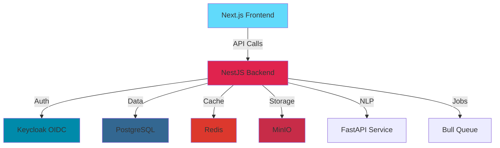

<div align="center">

# 🌺 CREOLE — Traditional Knowledge Digital Library

### *Center for Research in Ethnoscience, Orality, Language & Education*

<p align="center">
  
  
  
</p>

<p align="center">
  <strong>A comprehensive platform for documenting and protecting Haitian traditional knowledge and cultural expressions</strong>
</p>

<p align="center">
  <a href="#-features">Features</a> •
  <a href="#-quick-start">Quick Start</a> •
  <a href="#-architecture">Architecture</a> •
  <a href="#-documentation">Documentation</a> •
  <a href="#-contributing">Contributing</a>
</p>

---

## 🎉 What's New in Version 2.0

<table>
<tr>
<td width="50%">

### 🚀 **Major Enhancements**
- 📖 **[Complete Enhancement Guide →](ENHANCEMENTS.md)**
- 📋 **[New Files Summary →](NEW_FILES_SUMMARY.md)**

**49 files changed** | **4,261+ lines added** | **13 new entities**

</td>
<td width="50%">

### 💎 **Key Upgrades**
✅ Advanced Search & Discovery
✅ Analytics & Reporting
✅ 2FA & GDPR Compliance
✅ Multi-language Support (HT/FR/EN)
✅ Dark Mode & Accessibility

</td>
</tr>
</table>

</div>

---

## 🌟 Features

<table>
<tr>
<td width="33%" valign="top">

### 🔍 **Search & Discovery**
- Full-text search with PostgreSQL FTS
- Faceted filtering & aggregations
- Advanced date range queries
- Relevance ranking
- Multi-language search

</td>
<td width="33%" valign="top">

### 🔒 **Security & Compliance**
- OIDC PKCE authentication
- Two-factor authentication (2FA)
- GDPR compliance (export/delete)
- IP whitelisting
- Hash-chained audit logs

</td>
<td width="33%" valign="top">

### 📊 **Analytics & Insights**
- Real-time dashboards
- Event tracking (views, searches)
- User behavior analytics
- Export reports (CSV, JSON)
- Interactive visualizations

</td>
</tr>

<tr>
<td width="33%" valign="top">

### 🌍 **Internationalization**
- Haitian Creole (default)
- French translation
- English translation
- RTL support ready
- Dynamic language switching

</td>
<td width="33%" valign="top">

### 🤝 **Collaboration**
- Multi-user editing sessions
- Review workflow
- Comment & voting system
- Draft/publish pipeline
- Citation generation (5 formats)

</td>
<td width="33%" valign="top">

### 🎬 **Rich Media**
- Video/audio transcription
- OCR for documents
- Interactive maps (Leaflet)
- Timeline visualization
- WYSIWYG rich text editor

</td>
</tr>
</table>

---

## 🏗️ Architecture



### Tech Stack

<div align="center">

| Layer | Technologies |
|-------|-------------|
| **Frontend** | Next.js 14 • React 18 • TypeScript • i18n • Dark Mode |
| **Backend** | NestJS • TypeORM • GraphQL • Swagger/OpenAPI |
| **Database** | PostgreSQL 15 • Full-text Search • JSONB |
| **Cache & Jobs** | Redis • Bull Queue • Background Processing |
| **Auth & Security** | Keycloak • OIDC/PKCE • 2FA • GDPR |
| **Storage & Media** | MinIO • OCR • Transcription • Redaction |
| **Deployment** | Docker Compose • Health Checks • Auto-scaling Ready |

</div>

---

## 🚀 Quick Start

### Prerequisites
- Docker & Docker Compose
- Node.js 18+ (for local development)
- 4GB RAM minimum

### Installation

```bash
# 1. Clone the repository
git clone https://github.com/alovladi007/CREOLE---AYITI-Traditional-Knowledge-Digital-Library.git
cd CREOLE---AYITI-Traditional-Knowledge-Digital-Library

# 2. Setup environment
cp .env.example .env

# 3. Start all services
docker compose up --build

# 4. Seed initial data (after services are healthy)
docker compose exec backend npm run seed
```

### 🌐 Access the Platform

| Service | URL | Credentials |
|---------|-----|-------------|
| **Frontend** | http://localhost:3000 | See demo users below |
| **API Docs** | http://localhost:4000/api/docs | - |
| **GraphQL** | http://localhost:4000/graphql | - |
| **Keycloak** | http://localhost:8080 | admin / admin |
| **MinIO Console** | http://localhost:9001 | - |

### 👥 Demo Users

| Role | Email | Password |
|------|-------|----------|
| **Admin** | admin@creole | adminpass |
| **Examiner** | examiner@creole | examinerpass |
| **Community User** | user@creole | userpass |

---

## 📚 Documentation

<div align="center">

| Document | Description |
|----------|-------------|
| **[ENHANCEMENTS.md](ENHANCEMENTS.md)** | 📖 Complete feature documentation (18KB) |
| **[NEW_FILES_SUMMARY.md](NEW_FILES_SUMMARY.md)** | 📋 All new files and statistics |
| **[API Documentation](http://localhost:4000/api/docs)** | 📡 Swagger/OpenAPI interactive docs |

</div>

---

## 💡 Use Cases

<table>
<tr>
<td width="50%">

### 🏛️ **For Researchers**
- Access authenticated traditional knowledge
- Advanced search with multiple filters
- Export citations (APA, MLA, Chicago, Harvard, BibTeX)
- Track knowledge evolution with version history

</td>
<td width="50%">

### 👥 **For Communities**
- Submit and protect traditional knowledge
- Control access with TK/BC labels
- Engage through comments and voting
- Benefit-sharing contract management

</td>
</tr>
<tr>
<td width="50%">

### 🔬 **For Administrators**
- Review and approve submissions
- Monitor platform analytics
- Manage access requests
- Export comprehensive reports

</td>
<td width="50%">

### 🛠️ **For Developers**
- GraphQL & REST APIs
- Comprehensive Swagger docs
- Rate-limited endpoints
- Extensible architecture

</td>
</tr>
</table>

---

## 🎯 Key Workflows

### 1️⃣ Submit Traditional Knowledge
```
Navigate to Intake → Fill form → Choose classification →
Add TK labels → Set access tier → Submit for review
```

### 2️⃣ Request Access to Restricted Content
```
Find record → Click "Request Access" → Provide justification →
Wait for admin approval → Access granted
```

### 3️⃣ Review Submissions (Admin)
```
Dashboard → Pending Reviews → Assign reviewer →
Check quality → Approve/Reject with notes
```

---

## 🔐 Security Features

<div align="center">

| Feature | Description |
|---------|-------------|
| 🔑 **Authentication** | Keycloak OIDC with PKCE flow |
| 🛡️ **2FA** | TOTP with QR codes & backup codes |
| 📜 **Audit Trail** | Hash-chained tamper-evident logs |
| 🔒 **Data Protection** | Automatic PII & sacred term redaction |
| 🌍 **GDPR** | Full compliance (export, delete, portability) |
| 🚦 **Rate Limiting** | Multi-tier protection (10/s, 100/m, 1000/h) |

</div>

---

## 🧪 Testing

```bash
# Run E2E tests
docker compose exec frontend npm run test:e2e

# Run backend tests
docker compose exec backend npm test

# Check service health
curl http://localhost:4000/health
```

---

## 🌍 Roadmap

- [x] **v1.0**: Core TKDL functionality
- [x] **v2.0**: Comprehensive enhancements
- [ ] **v2.1**: Mobile native apps
- [ ] **v3.0**: AI-powered classification
- [ ] **v3.1**: Blockchain anchoring
- [ ] **v4.0**: Community governance

---

## 🤝 Contributing

We welcome contributions! Here's how you can help:

1. 🍴 Fork the repository
2. 🌿 Create a feature branch (`git checkout -b feature/amazing-feature`)
3. 💾 Commit your changes (`git commit -m 'Add amazing feature'`)
4. 📤 Push to the branch (`git push origin feature/amazing-feature`)
5. 🎉 Open a Pull Request

### Development Guidelines
- Follow the existing code style
- Write meaningful commit messages
- Add tests for new features
- Update documentation

---

## 📊 Project Statistics

<div align="center">

| Metric | Count |
|--------|-------|
| **Total Files** | 100+ |
| **Lines of Code** | 15,000+ |
| **Database Entities** | 20+ |
| **API Endpoints** | 50+ |
| **Supported Languages** | 3 (HT, FR, EN) |
| **Docker Services** | 7 |

</div>

---

## 📄 License

This project is licensed under the MIT License - see the [LICENSE](LICENSE) file for details.

---

## 📞 Support & Community

<div align="center">

### Need Help?

💬 [Open an Issue](https://github.com/alovladi007/CREOLE---AYITI-Traditional-Knowledge-Digital-Library/issues) •
📧 Contact: support@creole-tkdl.org •
📚 [Documentation](ENHANCEMENTS.md)

### Connect With Us

[](https://github.com/alovladi007/CREOLE---AYITI-Traditional-Knowledge-Digital-Library)
[](https://github.com/alovladi007/CREOLE---AYITI-Traditional-Knowledge-Digital-Library/issues)
[](https://github.com/alovladi007/CREOLE---AYITI-Traditional-Knowledge-Digital-Library/stargazers)

</div>

---

<div align="center">

### 🌺 Built with ❤️ for Haitian Cultural Preservation

**[⬆ Back to Top](#-creole--traditional-knowledge-digital-library)**

</div>
